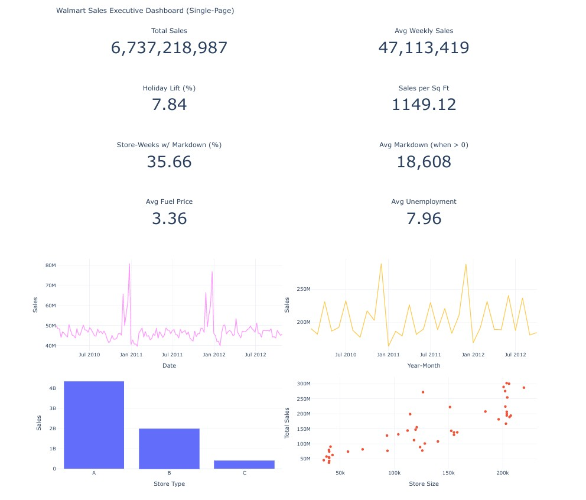

# 🛒 Walmart Sales KPI Analysis & Executive Dashboard

## 📊 Executive Dashboard Preview

---

## 📌 Overview

This project analyzes historical Walmart sales data to identify key performance indicators (KPIs) and present them in a **single-page, executive-level dashboard**. The analysis integrates weekly sales data with store metadata and external contextual factors to provide clear insights into sales trends, seasonality, promotional activity, and store efficiency.

The primary goal of this project is **descriptive and diagnostic analytics** — to understand what is happening in the data and why — rather than forecasting or predictive modeling.

---

## 🎯 Business Objectives

The analysis is designed to answer the following questions:

- How do total and average weekly sales trend over time?
- How do holiday weeks compare to non-holiday weeks?
- How does store size relate to total sales and sales efficiency?
- How do different store types perform relative to one another?
- How frequently are markdown promotions used?
- How do external economic factors contextualize sales performance?

---

## 📂 Data Sources

This project uses the public Walmart sales dataset originally released for a Kaggle forecasting competition.

### `train.csv`
- Weekly sales by store and department  
- **Grain:** Store × Department × Week  

### `features.csv`
- Store-level weekly context including markdowns, fuel prices, CPI, and unemployment  
- **Grain:** Store × Week  

### `stores.csv`
- Store metadata including type and physical size  
- **Grain:** Store  

> ⚠️ The test dataset is intentionally omitted, as this project focuses on KPI development and dashboarding rather than prediction.

---

## 🧱 Data Modeling & Feature Engineering

- Tables are joined using validated **many-to-one relationships** to preserve the original sales grain.
- Date features (year, month, week, year-month) are derived to support flexible aggregation.
- Holiday and promotional indicators are engineered to quantify seasonality and markdown activity.
- Store efficiency metrics such as **sales per square foot** are calculated to enable benchmarking.

The final analytical dataset is fully prepared for reporting and use in business intelligence tools.

---

## 📊 Key Performance Indicators (KPIs)

The dashboard highlights the following KPIs:

- **Total Sales**
- **Average Weekly Sales**
- **Holiday Sales Lift**
- **Sales per Square Foot**
- **Percentage of Store-Weeks with Markdowns**
- **Average Markdown Amount (when present)**
- **Average Fuel Price**
- **Average Unemployment Rate**

All KPIs are calculated consistently and used across dashboard visualizations.

---

## 📈 Dashboard

The project culminates in a **single-page interactive Plotly dashboard** designed for executive consumption. The dashboard includes:

- KPI summary cards
- Weekly and monthly sales trends
- Sales distribution by store type
- Store size vs. total sales comparison

An exported HTML version of the dashboard is included for easy sharing outside the notebook.

---

## 🔍 Key Insights

- Holiday weeks generate higher average weekly sales compared to non-holiday periods.
- Larger stores generally produce higher total sales, but **efficiency varies** when measured by sales per square foot.
- Store type materially impacts sales performance.
- Markdowns are a common pricing lever, occurring in a significant share of store-weeks.
- External economic indicators provide important context for interpreting sales trends.

---

## 🛠 Tools & Technologies

- **Python** (pandas, numpy)
- **Plotly** (interactive dashboarding)
- **Jupyter Notebook**
- Export-ready for **Power BI** or **Tableau**

---

## 🚀 Next Steps

- Recreate the dashboard in **Power BI or Tableau** for scheduled refresh and stakeholder access.
- Extend the analysis to evaluate markdown effectiveness and incremental lift.
- Add forecasting models to project future sales trends.
- Segment stores by efficiency to identify operational improvement opportunities.

---

## 👀 How to View the Dashboard

- Run the notebook top to bottom to generate the dashboard inline.
- Open the exported HTML file (`walmart_executive_dashboard.html`) in any web browser for full interactivity.
- The dashboard can also be saved as a PDF for portfolio or presentation use.

---

## ✍️ Author

**H. Elise Ramsey**  
This project was completed as part of ongoing data science skill development and portfolio building.
